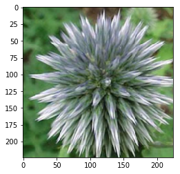
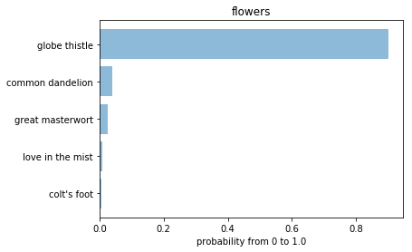

# [AIPND] Project: Image Classifier

Project code for Udacity's AI Programming with Python Nanodegree program 2018. In this project, I develop an image classifier built with PyTorch and then convert it into a command line application.

## Getting Started

Going forward, AI algorithms will be incorporated into more and more everyday applications. For example, you might want to include an image classifier in a smart phone app. To do this, you'd use a deep learning model trained on hundreds of thousands of images as part of the overall application architecture. A large part of software development in the future will be using these types of models as common parts of applications.
In this project, you'll train an image classifier to recognize different species of flowers. You can imagine using something like this in a phone app that tells you the name of the flower your camera is looking at. In practice you'd train this classifier, then export it for use in your application. We'll be using this dataset of 102 flower categories, you can see a few examples below.


The project is broken down into multiple steps:

* Load and preprocess the image dataset
* Train the image classifier on your dataset
* Use the trained classifier to predict image content

We'll lead you through each part which you'll implement in Python.
When you've completed this project, you'll have an application that can be trained on any set of labeled images. Here your network will be learning about flowers and end up as a command line application. But, what you do with your new skills depends on your imagination and effort in building a dataset. For example, imagine an app where you take a picture of a car, it tells you what the make and model is, then looks up information about it. Go build your own dataset and make something new.

### Prerequisites

Thinks you have to install or installed on your working machine:

* Python 3.7
* Numpy (win-64 v1.15.4)
* Pandas (win-64 v0.23.4)
* Matplotlib (win-64 v3.0.2)
* Jupyter Notebook
* Torchvision (win-64 v0.2.1)
* PyTorch (win-64 v0.4.1)

### Environment:
* [Miniconda](https://conda.io/miniconda.html) or [Anaconda](https://www.anaconda.com/download/)

### Installing

Use the package manager [pip](https://pip.pypa.io/en/stable/) or
[miniconda](https://conda.io/miniconda.html) or [Anaconda](https://www.anaconda.com/download/) to install your packages.  
A step by step guide to install the all necessary components in Anaconda for a Windows-64 System:
```bash
conda install -c conda-forge numpy
conda install -c conda-forge pandas
conda install -c conda-forge matplotlib
pip install torchvision
conda install -c pytorch pytorch
```

## Jupyter Notebook
* `Image Classifier Project.ipynb`

This jupyter notebook describe the whole project from udacity, from the beginning to the end.

## Running the project

The whole project is located in the file `Image Classifier Project.py` and it's include the training and the prediction part.
Based on this implementation the jupyter notebook was created from this.

### Ouput of `Image Classifier Project.py`

```bash
----- running with params -----
data directory:  flowers
save directory:  ./
architecture:    vgg13
learning rate:   0.001
hidden units:    500
epochs:          3
gpu:             True
-------------------------------
cnn neural network ...
  load image data ... done
create model ... done
initialized.
start deep-learning in -gpu- mode ...
epoch: 1/3..  training loss: 4.747..  validation loss: 3.824..  validation accuracy: 0.144
epoch: 1/3..  training loss: 4.012..  validation loss: 3.388..  validation accuracy: 0.251
epoch: 1/3..  training loss: 3.810..  validation loss: 2.892..  validation accuracy: 0.356
epoch: 1/3..  training loss: 3.473..  validation loss: 2.423..  validation accuracy: 0.448
epoch: 1/3..  training loss: 3.270..  validation loss: 2.184..  validation accuracy: 0.513
epoch: 1/3..  training loss: 2.993..  validation loss: 1.875..  validation accuracy: 0.540
epoch: 1/3..  training loss: 2.728..  validation loss: 1.718..  validation accuracy: 0.572
...
epoch: 3/3..  training loss: 1.833..  validation loss: 0.863..  validation accuracy: 0.762
epoch: 3/3..  training loss: 2.128..  validation loss: 0.862..  validation accuracy: 0.768
epoch: 3/3..  training loss: 2.076..  validation loss: 0.921..  validation accuracy: 0.755
epoch: 3/3..  training loss: 2.109..  validation loss: 0.883..  validation accuracy: 0.768
epoch: 3/3..  training loss: 2.098..  validation loss: 0.827..  validation accuracy: 0.784
-- done --
duration:  00:22:59
save model to:  ./checkpoint.pth ... done
calculate accuracy on test ... done.
accuracy of the network on the 10000 test images: 76 %
duration:  00:00:30
----- running with params -----
image file:      ./flowers/test/10/image_07117.jpg
load file:       checkpoint.pth
top k:           5
category names:  cat_to_name.json
gpu:             False
-------------------------------
load data dictionary ... done
load model from:  checkpoint.pth
create model ... done
initialize model ... done
--- prediction ---
load image data ... done
get prediction ... done.
 1 with 0.900 is globe thistle
 2 with 0.039 is common dandelion
 3 with 0.024 is great masterwort
 4 with 0.007 is love in the mist
 5 with 0.007 is colt´s foot
------------------
```

  

After this I will explain more in details the training and prediction steps.

### Train the model

To train the neural network (CNN), start the first part of file `Image Classifier Project.py` marked as `train`.

### Parameters of training

To change to input folder, the output size and some other parameters for the neural network, you can adapt these global constants inside the python file.

```python
# ---- set parameters ---------------
param_data_directory = "flowers"            # default: flowers
param_output_size = 102                     # 102 - original # 10 - test
param_save_file_name = "checkpoint.pth"     # checkpoint.pth
param_save_directory = "./"                 # ./
param_architecture = "vgg13"                # densenet121 or vgg13 or resnet18
param_learning_rate = 0.001                 # 0.001
param_hidden_units = 500                    # 500
param_epochs = 3                            # 3
param_gpu = True                            # True or False
# -----------------------------------
```

### Output of training
```bash
----- running with params -----
data directory:  flowers
save directory:  ./
architecture:    vgg13
learning rate:   0.001
hidden units:    500
epochs:          3
gpu:             True
-------------------------------
cnn neural network ...
  load image data ... done
create model ... done
initialized.
start deep-learning in -gpu- mode ...
epoch: 1/3..  training loss: 4.747..  validation loss: 3.824..  validation accuracy: 0.144
epoch: 1/3..  training loss: 4.012..  validation loss: 3.388..  validation accuracy: 0.251
epoch: 1/3..  training loss: 3.810..  validation loss: 2.892..  validation accuracy: 0.356
epoch: 1/3..  training loss: 3.473..  validation loss: 2.423..  validation accuracy: 0.448
epoch: 1/3..  training loss: 3.270..  validation loss: 2.184..  validation accuracy: 0.513
epoch: 1/3..  training loss: 2.993..  validation loss: 1.875..  validation accuracy: 0.540
epoch: 1/3..  training loss: 2.728..  validation loss: 1.718..  validation accuracy: 0.572
...
epoch: 3/3..  training loss: 1.833..  validation loss: 0.863..  validation accuracy: 0.762
epoch: 3/3..  training loss: 2.128..  validation loss: 0.862..  validation accuracy: 0.768
epoch: 3/3..  training loss: 2.076..  validation loss: 0.921..  validation accuracy: 0.755
epoch: 3/3..  training loss: 2.109..  validation loss: 0.883..  validation accuracy: 0.768
epoch: 3/3..  training loss: 2.098..  validation loss: 0.827..  validation accuracy: 0.784
-- done --
duration:  00:22:59
save model to:  ./checkpoint.pth ... done
calculate accuracy on test ... done.
accuracy of the network on the 10000 test images: 76 %
duration:  00:00:30
```


### Get prediction of the previous trained model

To get prediction of the previous trained neural network (CNN), start the second part of file `Image Classifier Project.py` marked as `predict`.


### Parameters of prediction

To change to input folder, the output size and some other parameters for the neural network, you can adapt these global constants inside the python file.

```python
# ---- set parameters ---------------
param_image_file = "./flowers/test/10/image_07117.jpg"  # default: flowers/
param_load_file_name = "checkpoint.pth"                 # default: checkpoint.pt
param_top_k = 5                                         # 5
param_category_names = "cat_to_name.json"               # cat_to_name.json
param_gpu = False                                       # True or False
# -----------------------------------
```

### Output of prediction

```bash
----- running with params -----
image file:      ./flowers/test/10/image_07117.jpg
load file:       checkpoint.pth
top k:           5
category names:  cat_to_name.json
gpu:             False
-------------------------------
load data dictionary ... done
load model from:  checkpoint.pth
create model ... done
initialize model ... done
--- prediction ---
load image data ... done
get prediction ... done.
 1 with 0.900 is globe thistle
 2 with 0.039 is common dandelion
 3 with 0.024 is great masterwort
 4 with 0.007 is love in the mist
 5 with 0.007 is colt´s foot
------------------
```


### get real prediction names

The neural network create class integers as output and these numbers should be converted to real names. To convertion from the class integer encoding to actual flower names can do with the `cat_to_name.json` file in the function:
```bash
def predict(model, image_file, topk=5)
```

## Command Line Application
The file `Image Classifier Project.py` was split into 2 main files for an better command line application:
* `train.py`
* `predict.py`

and the neural network (CNN) is extracted to the file `cnnnetwork.py`. All needed operations are included here.

### Usage of file `train.py`
* Train a new network on a data set with ```train.py```
  * Basic Usage : ```python train.py data_directory```
  * Prints out current epoch, training loss, validation loss, and validation accuracy as the network trains
  * Options:
    * Set directory to save checkpoints: ```python train.py data_dir --save_dir save_directory```
    * Choose architecture (resnet, densenet121 or vgg16 available): ```python train.py data_dir --arch "vgg13"```
    * Set hyperparameters: ```python train.py data_dir --learning_rate 0.01 --hidden_units 512 --epochs 20```
    * Use GPU for training: ```python train.py data_dir --gpu```

#### Sample Training Command
```python
train.py  flowers --arch "vgg13" --gpu --epochs 10 --hidden_units 512 --learning_rate 0.001
```

#### Ouput of file `train.py`

```bash
----- running with params -----
data directory:  flowers
save directory:  ./
architecture:    vgg13
learning rate:   0.001
hidden units:    512
epochs:          10
gpu:             True
-------------------------------
cnn neural network ...
load image data ... done
create model ... done
initialized.
start deep-learning in -gpu- mode ...
epoch: 1/10..  training loss: 4.808..  validation loss: 3.936..  validation accuracy: 0.177
epoch: 1/10..  training loss: 4.048..  validation loss: 3.324..  validation accuracy: 0.299
epoch: 1/10..  training loss: 3.620..  validation loss: 2.869..  validation accuracy: 0.332
epoch: 1/10..  training loss: 3.327..  validation loss: 2.435..  validation accuracy: 0.430
epoch: 1/10..  training loss: 3.206..  validation loss: 2.055..  validation accuracy: 0.507
epoch: 1/10..  training loss: 2.938..  validation loss: 1.826..  validation accuracy: 0.534
epoch: 1/10..  training loss: 2.817..  validation loss: 1.662..  validation accuracy: 0.573
...
epoch: 10/10..  training loss: 1.806..  validation loss: 0.600..  validation accuracy: 0.832
epoch: 10/10..  training loss: 1.807..  validation loss: 0.590..  validation accuracy: 0.850
epoch: 10/10..  training loss: 1.665..  validation loss: 0.602..  validation accuracy: 0.847
epoch: 10/10..  training loss: 1.786..  validation loss: 0.577..  validation accuracy: 0.851
epoch: 10/10..  training loss: 1.769..  validation loss: 0.593..  validation accuracy: 0.849
-- done --
duration:  01:17:18
save model to:  ./checkpoint.pth ... done
calculate accuracy on test ... done.
accuracy of the network on the 10000 test images: 82 %
duration:  00:00:23
```

### Usage of file `predict.py`
* Predict flower name from an image with ```predict.py``` along with the probability of that name. That is you'll pass in a single image ```/path/to/image``` and return the flower name and class probability
  * Basic usage: ```python predict.py /path/to/image checkpoint```
  * Options:
    * Return top **K** most likely classes:```python predict.py input checkpoint --top_k 3```
    * Use a mapping of categories to real names: ```python predict.py input checkpoint --category_names cat_to_name.json```
    * Use GPU for inference: ```python predict.py input checkpoint --gpu```

#### Sample Prediction Command
```python
predict.py "./flowers/test/10/image_07117.jpg" checkpoint.pth --gpu --category_names cat_to_name.json --top_k 5
```

#### Ouput of file `predict.py`

```bash
----- running with params -----
image file:          ./flowers/test/10/image_07117.jpg
load file:           checkpoint.pth
top k:               5
category names:      cat_to_name.json
gpu:                 True
-------------------------------
load data dictionary ... done
load model from:  checkpoint.pth
cnn neural network ...
load image data ... done
create model ... done
initialized.
done
--- prediction ---
load image data ... done
get prediction ... done.
 1 with 0.900 is globe thistle
 2 with 0.039 is common dandelion
 3 with 0.024 is great masterwort
 4 with 0.007 is love in the mist
 5 with 0.007 is colt´s foot
------------------
```


## Improvements

This is actually my best version of flower image classifier.
The next steps will be:
* do some experiments with the neural network to change the hyperparameters / hidden units / optimizer / structure of fully connected layers, ...
* convert the image classifier algorithm to keras
* convert the image classifier algorithm to fast.ai
* I will see what's comming next ...

## Authors

* Daniel Jaensch

## License
[MIT](https://choosealicense.com/licenses/mit/)
